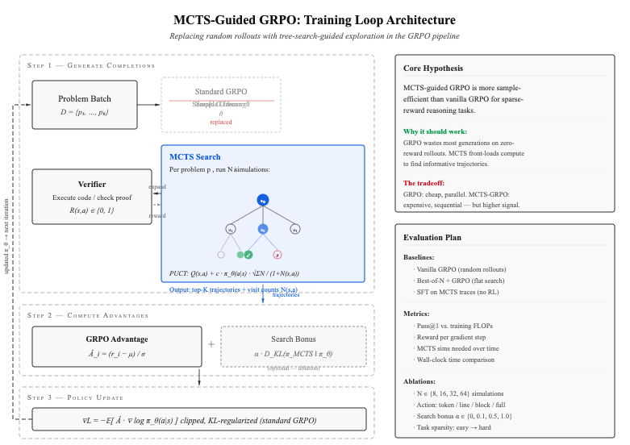

> Main problem: This is the critical flaw of standard GRPO: it relies on random temperature sampling to generate its rollout group. If you give an LLM a complex coding problem, the probability of it randomly generating the perfect syntax in a single shot is near zero. If all rollouts fail, the advantage signal is zero, and GRPO learns nothing. MCTS fixes the exploration bottleneck. It actively searches the state space, branching and backtracking based on environment feedback, to uncover a novel, high-reward solution path that random sampling would never find. Once MCTS uncovers that rare solution, GRPO uses it to compute the relative advantages and update the policy efficiently.

## 1. Abstract & Problem Statement

Current Reinforcement Learning from Verifiable Reward (RLVR) methodologies, such as Group Relative Policy Optimization (GRPO), suffer from severe exploration bottlenecks. Because GRPO relies on on-policy random temperature sampling to generate rollouts, it becomes highly sample-inefficient in complex domains—such as competitive programming—where the reward signal is sparse and the probability of zero-shot success is remarkably low.

This project proposes replacing standard flat-sampling RLVR with a Search-Based Distillation framework. We integrate Monte Carlo Tree Search (MCTS) directly into the GRPO pipeline. By utilizing MCTS at test-time as a structured exploration engine, the model autonomously uncovers verified reasoning paths using execution feedback. These tree-structured trajectories are then used to compute group relative advantages, continuously distilling compute-heavy search intelligence back into the single-pass generative policy.

## 2. Proposed Methodology

This architecture fuses the targeted exploration of MCTS with the stable policy updates of GRPO, operating via a Compute-Asymmetric Distillation loop.

### The Exploration Engine: MCTS Rollout Generation

Instead of generating $G$ independent rollouts via temperature sampling, the policy $\pi_\theta$ initiates a search tree from the prompt $s$.

* **Expansion & Execution:** The model generates reasoning steps and code blocks as distinct nodes. Terminal leaf nodes are executed against a programmatic verifier to receive a deterministic reward $R(s, a) \in \{0, 1\}$.
* **Trajectory Extraction:** Upon completion of the search budget, we extract a diverse group of $G$ trajectories $\{a_1, ..., a_G\}$ from the tree, heavily weighting paths that successfully navigated the verifier.

### The Optimization Engine: Tree-Guided GRPO

The extracted trajectories bypass the exploration bottleneck, guaranteeing the presence of high-reward signals within the group. We compute the standard GRPO relative advantage for each trajectory $i$:

$$\hat{A}_i = \frac{R_i - \mu_R}{\sigma_R}$$

The base policy is then updated using the clipped surrogate objective, anchoring the model to the MCTS discoveries while preventing catastrophic distribution shift via the Kullback-Leibler penalty:

$$\mathcal{L}(\theta) = - \frac{1}{G} \sum_{i=1}^G \left[ \min \left( \frac{\pi_\theta(a_i|s)}{\pi_{old}(a_i|s)} \hat{A}_i, \text{clip}\left(\frac{\pi_\theta(a_i|s)}{\pi_{old}(a_i|s)}, 1 - \epsilon, 1 + \epsilon \right) \hat{A}_i \right) \right] + \beta D_{KL}(\pi_\theta \parallel \pi_{ref})$$

## 3. Implementation Strategy

Implementing asynchronous tree search within an RL loop is highly memory-intensive. To execute this efficiently for a final submission, the architecture will be built entirely on a custom, optimized deep learning infrastructure leveraging PyTorch.

* **Framework Integration:** The MCTS rollout logic, including node expansion and PUCT (Predictor Upper Confidence Bound applied to Trees) scoring, will be engineered directly into the custom training loop to maintain strict control over memory buffers and prevent out-of-memory (OOM) failures.
* **RL Pipeline:** The outer loop optimization will seamlessly swap a standard generation phase for the MCTS trajectory extractor, feeding the verified paths directly into the advantage calculation.
* 
**Model Selection:** Qwen3-4B will serve as the base policy $\pi_\theta$, ensuring the parameter count remains viable for concurrent branch expansions during the inner search loop.

## 4. Experimental Design

The framework will be evaluated against complex coding benchmarks requiring multi-step logic and stateful reasoning.

### Environment & Dataset

* We will use the Overwrite Tests environment.

* The training dataset will consist of 992 LeetCode medium/hard problems.

### Baselines for Comparison

* **Standard GRPO:** To baseline the sample inefficiency of random-sampling exploration.
* **Offline Best-of-N (BoN):** To isolate the impact of the hierarchical MCTS structure versus flat reward ranking.

### Evaluation Metrics

* **Pass@1 Accuracy:** Measuring the zero-shot generative accuracy of the distilled model as training progresses.
* **Sample Efficiency:** Tracking the total number of environment executions required to achieve convergence compared to standard GRPO.

## Related Work

- TreeRL: LLM Reinforcement Learning with On-Policy Tree Search in ACL'25 ([github](https://github.com/THUDM/TreeRL)) 
- Tree-GRPO: [ICLR 2026] Tree Search for LLM Agent Reinforcement Learning ([github](https://github.com/AMAP-ML/Tree-GRPO))
- TreeGRPO: https://arxiv.org/pdf/2512.08153 

---

# v2 

## MCTS-Guided GRPO: Sample-Efficient LLM Post-Training via Tree-Search-Guided Exploration

### Problem

Group Relative Policy Optimization (GRPO) is the dominant approach for reinforcement learning from verifiable rewards (RLVR) in LLM post-training. For each problem in a batch, GRPO samples $G$ completions from the current policy $\pi_\theta$, scores them against a verifier, computes group-relative advantages, and takes a clipped policy gradient step.

**The core inefficiency is exploration quality.** Early in training, the policy is weak. Most of the $G$ sampled completions fail verification and receive zero reward. The gradient signal comes only from the relative differences among these mostly-failed attempts. This is especially problematic for complex coding and mathematical reasoning tasks where the reward landscape is sparse — random sampling rarely finds the successful trajectories that carry the most learning signal.

We ask a direct empirical question: can we improve the sample efficiency of GRPO by replacing its random rollout generation with Monte Carlo Tree Search (MCTS), thereby front-loading inference compute to find more informative training trajectories?

---

### Approach

The modification to GRPO is surgical. We replace one component — the completion generation strategy — while keeping the rest of the GRPO pipeline (advantage computation, clipped policy gradient, KL regularization) intact. This isolation is deliberate: it allows clean attribution of any performance differences to the search-guided exploration.

#### Standard GRPO (Baseline)

For each problem $p$ in a batch, standard GRPO independently samples $G$ completions from $\pi_\theta$, evaluates each against the verifier, and computes advantages as:

$$\hat{A}_i = \frac{r_i - \text{mean}(\mathbf{r})}{\text{std}(\mathbf{r})}$$

The policy is then updated via a clipped surrogate objective with a KL penalty against a reference policy $\pi_{\text{ref}}$:

$$\mathcal{L}_{\text{GRPO}}(\theta) = -\mathbb{E}\left[\min\left(\rho_t \hat{A}_t,\; \text{clip}(\rho_t, 1-\epsilon, 1+\epsilon)\hat{A}_t\right)\right] + \beta \, D_{\text{KL}}(\pi_\theta \| \pi_{\text{ref}})$$

where $\rho_t = \pi_\theta(a_t | s_t) / \pi_{\text{old}}(a_t | s_t)$.

#### MCTS-Guided Generation (Proposed)

We replace the random sampling step with a structured search. For each problem $p$, we run $N$ MCTS simulations over a reasoning tree where:

- **States** $s$ are the current prompt concatenated with the partial reasoning trace.
- **Actions** $a$ are the next generated chunk (line, block, or paragraph — granularity is an ablation variable).
- **Node selection** uses PUCT, balancing the estimated Q-value $Q(s, a)$ with the base policy's prior $\pi_\theta(a | s)$:

$$a^* = \arg\max_a \left[ Q(s, a) + c \cdot \pi_\theta(a | s) \cdot \frac{\sqrt{\sum_b N(s, b)}}{1 + N(s, a)} \right]$$

- **Terminal evaluation** executes against the verifier, yielding binary reward $R(s, a) \in \{0, 1\}$.

After search, we extract the top-$K$ trajectories ranked by visit count and Q-value. These trajectories — along with any failed but informative branches — are fed into the standard GRPO advantage computation. The key difference: the trajectories entering the advantage calculation are no longer random samples but search-curated completions with substantially higher reward rates.

#### Optional: Search Distribution Bonus

As an ablation, we add an auxiliary KL loss that directly pushes the base policy toward the MCTS visit-count distribution at branching points:

$$\mathcal{L}_{\text{aux}} = \alpha \cdot D_{\text{KL}}\!\left(\pi_{\text{MCTS}}(\cdot | s) \;\|\; \pi_\theta(\cdot | s)\right)$$

where $\pi_{\text{MCTS}}(a | s) \propto N(s, a)^{1/\tau}$. This is the distillation component. We treat it as optional because the primary hypothesis concerns the exploration benefit of MCTS within the existing GRPO framework, and we want to isolate that effect cleanly.

---

### The Core Tradeoff

This proposal is not claiming a free lunch. MCTS is expensive. For each training problem, we run $N$ forward passes through the model (one per simulation), plus code executions for terminal evaluations. Standard GRPO is embarrassingly parallel — generate a batch, score it, update. MCTS is inherently sequential per problem (select → expand → evaluate → backpropagate, repeat).

The empirical question is whether the improved signal quality per gradient step compensates for the increased inference cost per step. We hypothesize that for sparse-reward tasks (competitive programming, complex math), the crossover is favorable: GRPO wastes so many generations on uninformative failures that the search overhead pays for itself. For dense-reward tasks, vanilla GRPO may remain preferable.

---

### Open Technical Questions

#### Action Space Definition

MCTS requires a tractable branching factor. Token-level actions make the tree impossibly wide; full-completion actions collapse to Best-of-$N$. We need to define chunk boundaries — likely at the level of reasoning steps, code blocks, or sentences — and compute $\pi_\theta(a | s)$ over variable-length chunks as a meaningful PUCT prior. This is the hardest open problem in the proposal and we plan to explore multiple granularities empirically.

#### Value Estimation for Non-Terminal Nodes

Without a learned value function, MCTS only gets reward signal from complete rollouts. For deep reasoning trees, this makes search inefficient. We will explore using a lightweight value head $V_\phi(s)$ or simple heuristics (partial execution feedback, self-evaluation prompts) as intermediate value estimates. In the absence of a value function, Q-values are estimated by Monte Carlo return:

$$Q(s, a) = \frac{1}{N(s,a)} \sum_{i=1}^{N(s,a)} R_i$$

where $R_i$ is the terminal reward of the $i$-th rollout passing through $(s, a)$.

#### Compute Feasibility

On an academic cluster with Qwen3-4B, running 32 MCTS simulations per problem means 32× forward passes per training sample. We plan to mitigate this through KV-cache sharing across tree branches, batch parallelism across problems within each iteration, and adaptive simulation budgets that decrease as the policy improves.

---

### Related Work & Positioning

This proposal builds directly on established ideas. Expert Iteration (Anthony et al., 2017) and AlphaZero (Silver et al., 2017) demonstrated the search-distillation loop for games. STaR (Zelikman et al., 2022) and ReST (Gulcehre et al., 2023) apply self-improvement loops to LLM reasoning. DeepSeek-R1 explores MCTS for LLM reasoning. AlphaProof uses MCTS with formal verification for mathematical theorem proving.

**Our contribution is not architectural novelty.** It is a rigorous empirical investigation of whether MCTS-guided exploration improves sample efficiency within the specific GRPO framework that has become standard for open-weight LLM post-training. The value lies in compute-controlled comparisons across task types, ablation over search parameters, and characterization of when tree search helps versus when flat sampling suffices.

---

### Experimental Design

#### Baselines

| Method | Description | What It Tests |
|---|---|---|
| Vanilla GRPO | Random sampling, group-relative advantage | Baseline sample efficiency |
| Best-of-$N$ + GRPO | Sample $N$, keep top-$K$, run GRPO on filtered set | Flat search vs. tree search |
| SFT on MCTS traces | Supervised fine-tuning on verified trajectories only | Is RL needed, or is the data enough? |
| MCTS-GRPO (ours) | MCTS-guided generation within standard GRPO loop | Full proposed method |

#### Metrics

1. **Pass@1 vs. training FLOPs** — The primary comparison. We plot single-pass accuracy against total compute (inference + training) to test whether MCTS-GRPO reaches a given accuracy threshold with fewer total FLOPs.
2. **Reward per gradient step** — Measures signal quality: how much useful information each policy update receives.
3. **MCTS simulations required over training** — Tests whether the improving policy prior reduces search cost over time (the virtuous cycle hypothesis).
4. **Wall-clock time comparison** — Practical feasibility on academic hardware.

#### Ablations

| Variable | Values | Tests |
|---|---|---|
| MCTS simulations $N$ | 8, 16, 32, 64 | Search budget vs. quality |
| Action granularity | Token, line, block, full | Branching factor tradeoff |
| Search bonus weight $\alpha$ | 0, 0.1, 0.5, 1.0 | Distillation contribution |
| Task sparsity | Easy → hard benchmarks | When does MCTS help most? |

---

### Implementation

- **Base model:** Qwen3-4B (small enough for multiple inference passes per training step)
- **Training framework:** Torchplate (training loop control) + minpost (GRPO implementation)
- **MCTS:** Custom implementation with KV-cache sharing across tree branches
- **Verification:** Sandboxed code execution for coding tasks; symbolic verification for math
- **Benchmarks:** APPS, MATH, and competition-level coding problems with execution-based verification

---

### Summary

This proposal is an empirical investigation, not an architectural contribution. The mechanism — using search to improve exploration in policy gradient methods — is established. Our contribution is a rigorous, compute-controlled study of whether and when MCTS-guided generation improves GRPO sample efficiency for LLM post-training. The expected output is a clear characterization of the cost-quality tradeoff between search-guided and random exploration across task difficulties and compute budgets.

    
