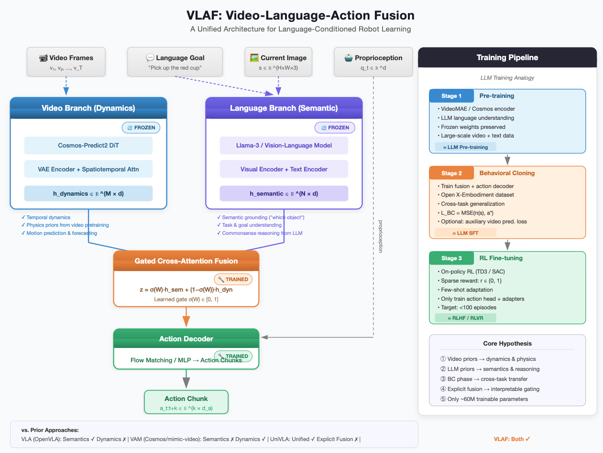
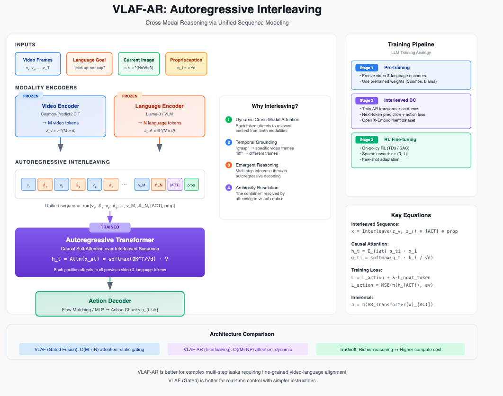
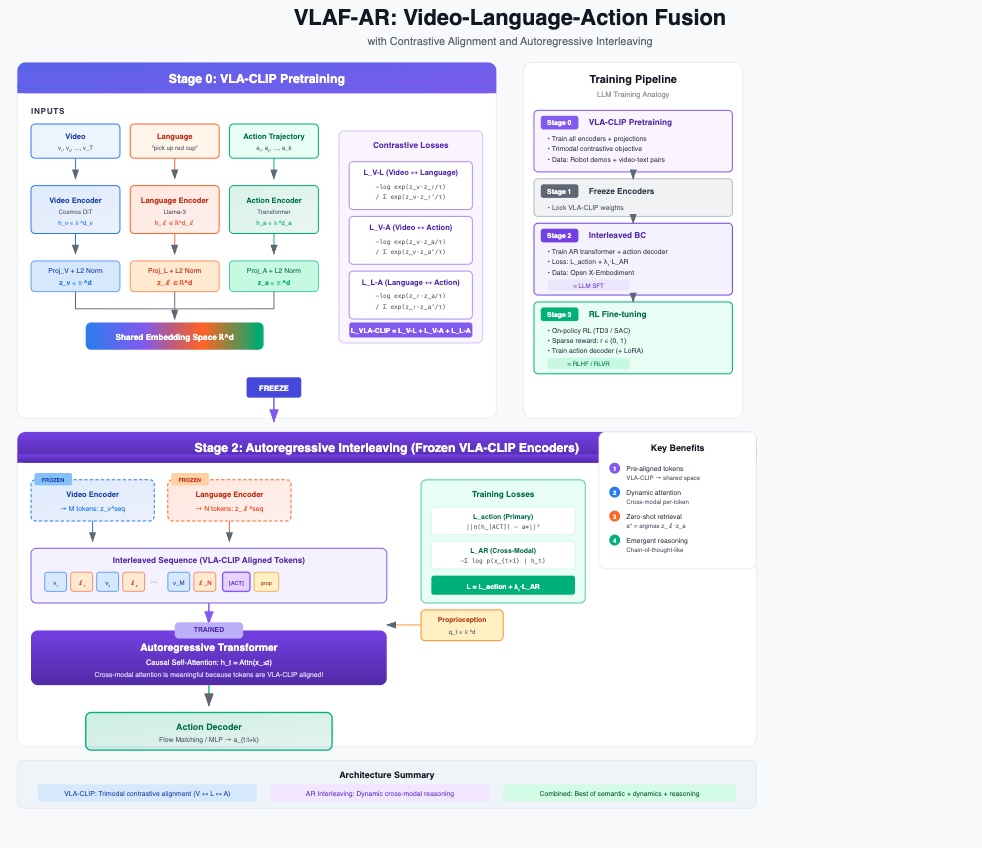
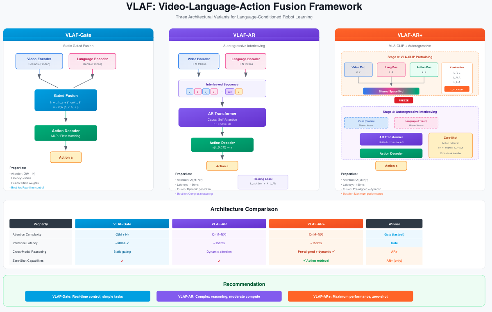

> Main idea is to combine VLM backbone for semantics, with video model backbone for physics/dynamics as a unified prior for downstream tasks on robot learning. 

> Update: see [DreamZero: World Action Models are Zero-shot Policies](https://dreamzero0.github.io/) which validates a lot of the thinking on the video model part of the backbone. 


**Combining VLA semantic understanding with video model dynamics priors for sample-efficient, language-conditioned robot manipulation.**

<p align="center">
  
</p>

---

## Motivation

Recent advances in robot learning have produced two powerful but complementary paradigms:

| | **VLAs** (e.g., OpenVLA, π₀) | **Video-Action Models** (e.g., Cosmos Policy, UVA) |
|---|---|---|
| **Strength** | Rich semantic grounding from VLMs — understands *which object*, spatial relations, task goals | Temporal dynamics from video pretraining — understands *how things move*, physics, motion patterns |
| **Weakness** | No dynamics prior; treats each frame independently | Weak semantic grounding; typically uses lightweight text encoders (T5), not full VLMs |

**VLAF bridges this gap.** Rather than training a single monolithic model from scratch, VLAF fuses two frozen pretrained backbones — a vision-language model and a video diffusion model — through a lightweight, trainable gated cross-attention module.

## Key Idea

```
VLAs have semantics but lack dynamics.
Video-Action Models have dynamics but lack semantics.
VLAF fuses them.
```

VLAF keeps both backbones frozen and trains only a small fusion module (~60M params) and action decoder, preserving the pretrained capabilities of each while learning to combine them. A learned gate adaptively weights semantic vs. dynamics features per-task: pure semantic attention for object selection, pure dynamics for motion execution, balanced for complex manipulation.

## Architecture

VLAF processes four input streams — video frames, language instructions, robot state, and proprioception — through two parallel frozen branches:

**Language Branch** (Llama-3 / VLM): Encodes the current image and language goal into semantic features capturing object identities, spatial relations, and task understanding.

**Video Branch** (Cosmos-Predict2 DiT): Encodes video history into dynamics features capturing motion patterns, physics priors, and temporal predictions.

A **Gated Cross-Attention Fusion Module** combines these representations:

$$z_{\text{fused}} = \sigma(W) \cdot h_{\text{semantic}} + (1 - \sigma(W)) \cdot h_{\text{dynamics}}$$

The fused representation feeds into a **Flow Matching Action Decoder** that outputs action chunks (end-effector trajectories).

<p align="center">
  
</p>

## Training Pipeline

VLAF follows a three-stage pipeline analogous to the modern LLM training recipe:

### Stage 1: Pre-training (Frozen Backbones)
Load pretrained video encoder (Cosmos-Predict2) and language model (Llama-3). Both remain frozen throughout training, preserving their respective capabilities.

*Analogy: LLM pre-training — large-scale representation learning.*

### Stage 2: Behavioral Cloning (Mid-training)
Attach a trainable action decoder and fusion module. Train on large-scale robot demonstration datasets (Open X-Embodiment, DROID) with MSE loss to bake in cross-task and cross-embodiment generalization.

*Analogy: LLM supervised fine-tuning (SFT) — adapting to the target domain.*

### Stage 3: RL Fine-tuning (Post-training)
Fine-tune on a specific target task using on-policy or off-policy RL (TD3/SAC) with sparse rewards (success/failure). Only the action head and optional LoRA adapters are updated. This stage is designed to be sample-efficient (few-shot) because the video backbone provides dynamics priors, the LLM provides semantic priors, and the BC phase provides manipulation priors.

*Analogy: RLHF/RLVR — task-specific alignment.*

```
┌─────────────────┐     ┌─────────────────┐     ┌─────────────────┐
│  Stage 1:       │     │  Stage 2:       │     │  Stage 3:       │
│  Pre-training   │────▶│  Behavioral     │────▶│  RL Fine-tuning │
│                 │     │  Cloning        │     │                 │
│  Frozen video + │     │  Action decoder │     │  On-policy RL   │
│  language       │     │  + fusion on    │     │  on target task │
│  backbones      │     │  robot demos    │     │  (few-shot)     │
└─────────────────┘     └─────────────────┘     └─────────────────┘
  ≈ LLM Pre-train        ≈ LLM SFT              ≈ RLHF / RLVR
```

## Algorithm

```
Algorithm: VLAF Training Pipeline
─────────────────────────────────────────────────────────
Require: Pretrained f_v (video encoder), f_ℓ (language model)
         BC dataset D_BC; Target environment E

Stage 1: Load frozen backbones
  f_v ← Cosmos-Predict2,  f_ℓ ← Llama-3

Stage 2: Behavioral Cloning
  Initialize fusion module g_φ and action decoder π_θ
  for each batch (v, ℓ, s, a*) ~ D_BC:
      h_v ← f_v(v)                    // frozen forward pass
      h_ℓ ← f_ℓ(ℓ)                    // frozen forward pass
      h   ← g_φ(h_v, h_ℓ; φ)         // trainable fusion
      â   ← π_θ(h)                    // trainable action decoder
      L   ← ‖â - a*‖²
      Update φ, θ via gradient descent on L

Stage 3: RL Fine-tuning
  for each episode:
      Collect rollouts with π_θ in E
      Store (s, a, r, s') in replay buffer B
      Update θ (and optionally φ) via SAC/TD3 on B

Return: π_θ
```

## Design Decisions & Open Questions

**Why explicit fusion over unified autoregressive?**
Concurrent work like [UniVLA](https://arxiv.org/abs/2506.19425) uses a single autoregressive transformer that interleaves video prediction and action prediction. VLAF instead keeps branches separate and fuses post-hoc. The bet is that two pretrained specialists outperform one jointly-trained generalist when robot data is limited (1K–10K demos). Whether this holds is an open empirical question.

**Why frozen backbones?**
Freezing preserves the full pretrained capability of each model and reduces trainable parameters to ~60M (fusion + decoder only). This enables training on a single GPU and avoids catastrophic forgetting.

**Video prediction as auxiliary loss.**
UniVLA shows that world model post-training (training on video prediction without actions) dramatically improves downstream policy learning. VLAF could incorporate this by adding an auxiliary video prediction loss during BC.

**Deployment considerations.**
At inference, the video backbone can potentially be distilled away — the action decoder may have the dynamics representation "baked in" from training. On-policy distillation could prune the system to meet real-time control requirements (~20 Hz).

## Positioning in the Landscape

The current video-action model space has two main camps:

**Camp 1 — Autoregressive Interleaving:** Predict video → predict action → repeat. (UniVLA [1], UVA [4])

**Camp 2 — Explicit Branch Fusion:** Maintain separate modality encoders, fuse via cross-attention or gating. (VLAF, this work)

A key distinction from prior work: many papers claiming "video + language" fusion simply use a T5 text encoder projected into the video model's feature space [5]. VLAF uses a full VLM backbone (Llama-3), preserving the rich semantic and reasoning capabilities that make VLAs powerful.

## Proposed Evaluation

| Benchmark | Focus | Why |
|-----------|-------|-----|
| **LIBERO** | Language-conditioned manipulation (4 suites) | Standard VLA benchmark, direct comparison with OpenVLA |
| **RoboCasa** | Long-horizon kitchen tasks | Tests dynamics understanding and generalization |
| **ALOHA** | Bimanual manipulation | Tests fine-grained motor control |

**Baselines:**
- OpenVLA (VLA only — semantics, no dynamics)
- Cosmos Policy (video only — dynamics, no VLM semantics)
- mimic-video (video-action, lightweight language)
- UniVLA (unified autoregressive — the main competitor)

**Key hypotheses to test:**
1. VLAF (fusion) > VLA alone and > VAM alone on language-conditioned tasks
2. VLAF is competitive with unified autoregressive approaches (UniVLA)
3. The gating mechanism learns interpretable task-dependent weighting
4. RL fine-tuning is sample-efficient (<100 episodes) due to strong priors

## Minimum Viable Experiment

The smallest experiment that validates whether VLAF has legs:

1. Take **OpenVLA** features (VLA baseline)
2. Take **mimic-video** features (video baseline)
3. **Concatenate** naively and train an action decoder
4. Compare to each alone on LIBERO

If naive concatenation improves over either branch alone, the fusion hypothesis is validated and the full gated cross-attention architecture is worth pursuing.

## References

| # | Paper | Authors | Date |
|---|-------|---------|------|
| 1 | [UniVLA: Unified Vision-Language-Action Model](https://arxiv.org/abs/2506.19425) | Wang et al. | Jun 2025 |
| 2 | [Cosmos Policy: Fine-Tuning Video Models for Visuomotor Control](https://openreview.net/forum?id=wPEIStHxYH) | Kim et al. | Jan 2026 |
| 3 | [mimic-video: Video-Action Models Beyond VLAs](https://arxiv.org/abs/2412.xxxxx) | Pai et al. | Dec 2025 |
| 4 | [Unified Video Action Model (UVA)](https://arxiv.org/abs/2502.xxxxx) | Li et al. | Feb 2025 |
| 5 | [LingBot-VA: Causal World Modeling for Robot Control](https://arxiv.org/abs/2501.xxxxx) | Li et al. | Jan 2026 |
| 6 | [DreamZero: World Action Models are Zero-shot Policies](https://dreamzero0.github.io/) | Ye et al. | Feb 2026 |


## Status

🚧 **This is an active research proposal.** Code and experiments are in progress. Contributions, feedback, and collaboration inquiries are welcome.


## Pseudocode 

```python
"""
VLAF: Video-Language-Action Fusion

Core architecture: frozen VLM + frozen video model → gated cross-attention fusion → action decoder.
"""

import torch
import torch.nn as nn


class GatedCrossAttentionFusion(nn.Module):
    """Learnable gated cross-attention module that fuses semantic and dynamics features.
    
    The gate σ(W) ∈ [0, 1] controls the relative influence of dynamics vs. semantic features:
        z_fused = σ(W) · CrossAttn(h_sem, h_dyn) + (1 - σ(W)) · h_sem
    
    When g → 0: pure semantic (object selection tasks)
    When g → 1: pure dynamics (motion execution tasks)  
    When g ≈ 0.5: balanced (complex manipulation)
    """

    def __init__(self, d_model: int = 512, n_heads: int = 8, dropout: float = 0.1):
        super().__init__()
        self.cross_attn = nn.MultiheadAttention(d_model, n_heads, dropout=dropout, batch_first=True)
        self.gate = nn.Parameter(torch.zeros(1))  # initialized to σ(0) = 0.5
        self.proj_semantic = nn.Linear(d_model, d_model)
        self.proj_dynamics = nn.Linear(d_model, d_model)
        self.layer_norm = nn.LayerNorm(d_model)

    def forward(self, h_semantic: torch.Tensor, h_dynamics: torch.Tensor) -> torch.Tensor:
        """
        Args:
            h_semantic: (B, N, d) — VLM features (object identities, spatial relations, goals)
            h_dynamics: (B, M, d) — Video model features (motion patterns, physics priors)
        
        Returns:
            h_fused: (B, N, d) — fused representation
        """
        h_sem = self.proj_semantic(h_semantic)
        h_dyn = self.proj_dynamics(h_dynamics)

        # Cross-attention: semantic queries attend to dynamics keys/values
        cross_out, _ = self.cross_attn(query=h_sem, key=h_dyn, value=h_dyn)

        # Gated fusion
        g = torch.sigmoid(self.gate)
        h_fused = g * cross_out + (1 - g) * h_sem

        return self.layer_norm(h_fused)


class ActionDecoder(nn.Module):
    """MLP action decoder that maps fused features + proprioception to action chunks.
    
    For the full system, this would be replaced with a Flow Matching network.
    """

    def __init__(
        self,
        d_fused: int = 512,
        d_proprio: int = 14,
        d_action: int = 7,
        chunk_size: int = 8,
        hidden_dim: int = 256,
    ):
        super().__init__()
        self.chunk_size = chunk_size
        self.net = nn.Sequential(
            nn.Linear(d_fused + d_proprio, hidden_dim),
            nn.ReLU(),
            nn.Linear(hidden_dim, hidden_dim),
            nn.ReLU(),
            nn.Linear(hidden_dim, d_action * chunk_size),
        )

    def forward(self, h_fused: torch.Tensor, q: torch.Tensor) -> torch.Tensor:
        """
        Args:
            h_fused: (B, d) — pooled fused features
            q: (B, d_proprio) — proprioceptive state
        
        Returns:
            actions: (B, chunk_size, d_action) — predicted action chunk
        """
        x = torch.cat([h_fused, q], dim=-1)
        out = self.net(x)
        return out.view(-1, self.chunk_size, out.shape[-1] // self.chunk_size)


class VLAF(nn.Module):
    """Video-Language-Action Fusion model.
    
    Architecture:
        1. Frozen video backbone → h_dynamics
        2. Frozen VLM backbone → h_semantic
        3. Gated cross-attention fusion → h_fused
        4. Action decoder → action chunks
    
    Only the fusion module and action decoder are trained.
    """

    def __init__(
        self,
        video_backbone: nn.Module,
        language_backbone: nn.Module,
        d_model: int = 512,
        d_proprio: int = 14,
        d_action: int = 7,
        chunk_size: int = 8,
    ):
        super().__init__()

        # Frozen backbones (no gradients)
        self.video_backbone = video_backbone
        self.language_backbone = language_backbone
        for param in self.video_backbone.parameters():
            param.requires_grad = False
        for param in self.language_backbone.parameters():
            param.requires_grad = False

        # Trainable components
        self.fusion = GatedCrossAttentionFusion(d_model=d_model)
        self.action_decoder = ActionDecoder(
            d_fused=d_model,
            d_proprio=d_proprio,
            d_action=d_action,
            chunk_size=chunk_size,
        )

    def forward(
        self,
        video: torch.Tensor,
        language: torch.Tensor,
        image: torch.Tensor,
        proprio: torch.Tensor,
    ) -> torch.Tensor:
        """
        Args:
            video: (B, T, C, H, W) — video history
            language: (B, L) — tokenized language instruction
            image: (B, C, H, W) — current frame
            proprio: (B, d_proprio) — proprioceptive state
        
        Returns:
            actions: (B, chunk_size, d_action) — predicted action chunk
        """
        with torch.no_grad():
            h_dynamics = self.video_backbone(video)          # (B, M, d)
            h_semantic = self.language_backbone(image, language)  # (B, N, d)

        h_fused = self.fusion(h_semantic, h_dynamics)        # (B, N, d)
        h_pooled = h_fused.mean(dim=1)                       # (B, d)

        actions = self.action_decoder(h_pooled, proprio)     # (B, k, d_a)
        return actions

    @property
    def trainable_params(self) -> int:
        return sum(p.numel() for p in self.parameters() if p.requires_grad)

    @property
    def total_params(self) -> int:
        return sum(p.numel() for p in self.parameters())

    def get_gate_value(self) -> float:
        """Returns the current gate value σ(W) for interpretability analysis."""
        return torch.sigmoid(self.fusion.gate).item()
```


---


:::{.callout-note}
## Notes/brainstorm 

- Main design decision here is you do the fusion between the two modalities (video, language). Late fusion post-encoding? pre-encoding fusion? No fusion and do autoregressive interleaving instead (UVA/univla-style)? 
- DreamZero paper, and some of the cosmos paper, seem to be validating lots of the video model hyphotheses in general. 
- For the video model, there are two approaches: train it such that the loss is simple next frame prediction (i.e., true self-supervised) or train it such that it predicts the action, given the video frame(s) (i.e., the world modeling approach). 
- One thought: we can use a clip-style contrastive objective, to pair them together. let's say you have {video, language, action} or some combination of them thereof, train a CLIP-style contrastive learning objective as your backbone. 
- 3 variants so far: 
    1. VLAF-Fusion (standard VLAF fusion)
    2. VLA-AR (interleaving autoregressive)
    3. VLA-Contrastive (like number 2 but use contrastive learning)

:::

---


::: {.callout-note}

## Diagrams 


### Variant 1 (og): VLAF-Fusion 

<div style="text-align: center;">    </div>


### Variant 2: VLAF-AR 


<div style="text-align: center;">    </div>

### Variant 3: VLAF-Contrastive 

<div style="text-align: center;">    </div>

### Combined diagram 

<div style="text-align: center;">    </div>

::: 

---

## Variant #2: VLAF-AR 

Note: you don't actually train the encoders. Use them as tokenizers/feature extractors. 

```
Frozen Encoders          Trained AR Transformer
      ↓                         ↓
[v₁, v₂, ..., v_M]  ──┐
                      ├──→  [v₁, ℓ₁, v₂, ℓ₂, ...] ──→ h_t ──→ predict x_{t+1}
[ℓ₁, ℓ₂, ..., ℓ_N]  ──┘                                         ↓
                                                            L_AR = -log p(x_{t+1} | x_{≤t})
```


## Variant #3: VLAF-Contrastive 

See [vlaf-contrastive.md](vlaf-contrastive.md)

